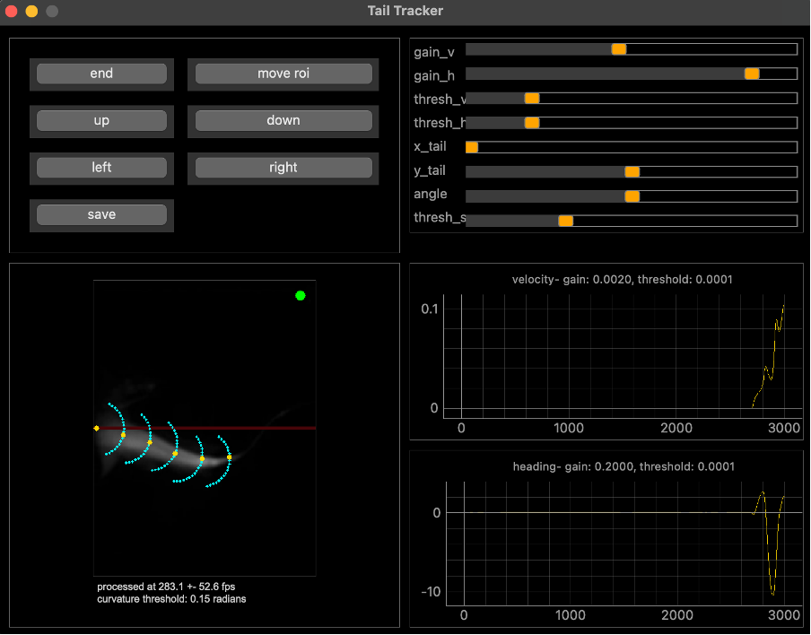

# Tail-tracking software for headfixed (zebra) fish 

This software package is linked to the publication 'supercoolfish VR behavior' [LINK].  
If you use use this code for your publication, please cite us.

### Overview
This software package was designed to track the tail of a headfixed adult zebrafish (*Danio rerio*) to live update the virtual reality (VR) script [LINK].
Input is a video stream of the tail of the fish or an example movie.  
Ouput consists of a UDP broadcast (with the velocity, tail angle, swimming T/F and a counter), a video file, and a log file with i.a. of velocity, heading, velocity gain, heading gain, velocity threshold, heading threshold, cumulative tail angle and curvature threshold. The VR script can use the UDP broadcast information to create a closed looped VR environment.

## System requirements
PC
python

## Installation instructions
.yml file

## User manual
The tail tracking GUI can either be ran from the camera feed or from from a video file (example can be found here). This allows the user to test the entire VR system without using a live fish.  

Input parameters such as camera type, illumination, tracking settings and save paths are hard coded or can be read from a .ini file (for the runfromvideo.py). 
Running either script will show a GUI with position controls for the ROI of the live video stream, sliders with tracking parameters, and two output graphs with the velocity and heading gain. The sliders allow the user to update some tracking parameters live. The resulting tracking is also plotted on top of the video stream of the fish.

### Tracking

## Hardware

For the tail tracking, we used an Ximea MQ022RG-CM-S7 USB camera (NIR, 2.2 Mpix, 169FPS). [LINK](https://www.ximea.com/products/usb-vision-industrial/xiq-usb3-compact-cmos-cameras/cmosis-cmv2000-spartan-7-usb3-b-w-nir-compact-camera)  
and a Navitar zoom lens (MVL7000-18-108mm EFL) [LINK](https://www.thorlabs.com/item/MVL7000)  
Besides the Ximea camera, there is also an option provided to use an Alvium camera.
For lightning, a Thorlabs IR 850nm 900mW LED and T-Cube LED driver were used. [LINK](https://www.thorlabs.com/item/m850l3?aID=5645d0fab002954043018c3840106dce&aC=1))(discontinued), [LINK](https://www.thorlabs.com/newgrouppage9.cfm?objectgroup_id=2616)  
A bandpass filter centered around 810nm was used to ensure that only the reflected tail-tracking illumination was captured by the tail tracking camera. [LINK](https://midopt.com/filters/bp810/).  

In our case, we set the exposure time to XXX at 120 fps, which the tail of the fish imaged at approximately 80um/pixel.  

## License
check with FMI

## Authors
Alex Javier, Sriram Narayanan, Jan Eckhardt, Jaap van Krugten, Rainer Friedrich
